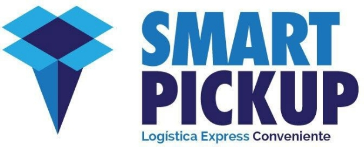

# Consultar Estado de Orden

Este endpoint se utiliza para consultar el estado de una orden utilizando un TrackID específico.

## Detalles de la solicitud

- **Método:** GET
- **URL:** `{{host}}/public/trackings/?search={{trackID}}`
- **Tipo de contenido:** application/json

## Parámetros de la solicitud

| Parámetro | Tipo   | Descripción                                       |
| --------- | ------ | ------------------------------------------------- |
| trackID   | string | Identificador único de la orden que se desea ver. |

## Encabezados de la solicitud

- `Authorization`: Token {{token}}

## Ejemplo de solicitud

```http
GET {{host}}/public/trackings/?search={{trackID}}
Content-Type: application/json
Authorization: Token {{token}}
```

### Respuesta Exitosa

La respuesta exitosa devolverá el estado de la orden consultada.

### Ejemplo de respuesta exitosa
```json
{
  "tracking_id": "MIALWH000000189519",
  "status": "Delivered",
  "date_delivered": "2024-04-30T10:15:00Z",
  "delivery_notes": "Delivered to the recipient's address successfully."
}
```

### Respuesta de Error
En caso de error, se devolverá un código de estado HTTP correspondiente junto con un mensaje de error explicativo.

### Ejemplo de respuesta de error
```json
{
  "error": "Not Found",
  "message": "The tracking ID MIALWH000000189519 was not found."
}
```

### Códigos de Estado - Código	Descripción
- 200	OK - Solicitud exitosa
- 404	Not Found - La orden no fue encontrada
- 401	Unauthorized - Token de autenticación inválido